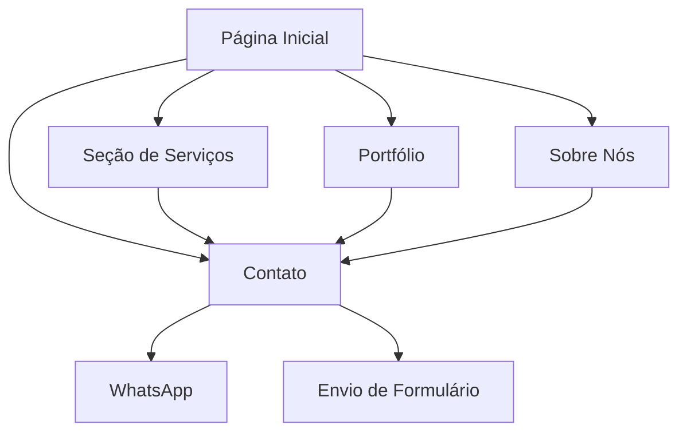

# Documento de Requisitos do Produto - Portfólio Empresa de Desenvolvimento Web

## 1. Visão Geral do Produto

Portfólio moderno e elegante para empresa de desenvolvimento de sites e aplicações web, transmitindo profissionalismo, inovação e confiança através de design limpo, tipografia moderna e cores equilibradas.

- **Objetivo Principal**: Apresentar serviços de desenvolvimento web de forma impactante e profissional
- **Público-Alvo**: Empresas e empreendedores que buscam soluções digitais personalizadas
- **Valor de Mercado**: Demonstrar capacidade técnica e criativa para atrair novos clientes

## 2. Funcionalidades Principais

### 2.1 Papéis de Usuário

| Papel | Método de Acesso | Permissões Principais |
|-------|------------------|----------------------|
| Visitante | Acesso direto ao site | Navegar, visualizar conteúdo, enviar formulário de contato |
| Administrador | Acesso via CMS/painel | Gerenciar conteúdo, projetos do portfólio, mensagens de contato |

### 2.2 Módulos de Funcionalidade

Nosso portfólio consiste nas seguintes páginas principais:

1. **Página Inicial**: seção hero com chamada principal, navegação, prévia de serviços
2. **Seção de Serviços**: detalhamento dos três serviços principais da empresa
3. **Portfólio**: galeria de projetos realizados com imagens e descrições
4. **Sobre Nós**: apresentação da empresa, experiência e especialização
5. **Contato**: formulário de contato integrado com e-mail/WhatsApp
6. **Rodapé**: informações de contato e redes sociais

### 2.3 Detalhes das Páginas

| Nome da Página | Nome do Módulo | Descrição da Funcionalidade |
|----------------|----------------|-----------------------------|
| Página Inicial | Seção Hero | Exibir chamada principal "Transformamos ideias em soluções digitais", botão CTA, animações sutis |
| Página Inicial | Navegação | Menu responsivo com links para todas as seções, logo da empresa |
| Página Inicial | Prévia de Serviços | Cards com ícones modernos apresentando os 3 serviços principais |
| Seção de Serviços | Criação de Sites | Detalhamento do serviço de desenvolvimento de sites profissionais |
| Seção de Serviços | Aplicações Web | Apresentação do desenvolvimento de aplicações web customizadas |
| Seção de Serviços | Soluções Personalizadas | Descrição de sistemas internos, agendamentos, dashboards sob medida |
| Portfólio | Galeria de Projetos | Grid responsivo com imagens, títulos, descrições breves e links dos projetos |
| Portfólio | Filtros de Categoria | Sistema de filtros para organizar projetos por tipo ou tecnologia |
| Sobre Nós | Apresentação da Empresa | Texto destacando experiência, especialização e diferenciais |
| Sobre Nós | Equipe | Apresentação dos profissionais e suas especialidades |
| Contato | Formulário | Campos para nome, e-mail, telefone, mensagem com validação |
| Contato | Integração WhatsApp | Botão direto para contato via WhatsApp |
| Rodapé | Informações de Contato | E-mail, telefone, endereço da empresa |
| Rodapé | Redes Sociais | Links para perfis sociais com ícones modernos |

## 3. Processo Principal

**Fluxo do Visitante:**
O usuário acessa a página inicial, visualiza a chamada principal e serviços em destaque, navega pelos projetos do portfólio, conhece mais sobre a empresa na seção "Sobre Nós" e finaliza entrando em contato através do formulário ou WhatsApp.

**Fluxo do Administrador:**
O administrador acessa o painel de controle, gerencia o conteúdo dos projetos no portfólio, atualiza informações da empresa e responde às mensagens de contato recebidas.

## 4. Design da Interface do Usuário

### 4.1 Estilo de Design

- **Cores Primárias**: Azul (#2563EB), Roxo (#7C3AED), Branco (#FFFFFF)
- **Cores Secundárias**: Cinza escuro (#1F2937), Cinza claro (#F9FAFB)
- **Estilo dos Botões**: Bordas arredondadas (8px), gradientes sutis, efeitos hover
- **Tipografia**: Inter ou Poppins, tamanhos 16px (corpo), 24px (subtítulos), 48px (títulos principais)
- **Layout**: Design baseado em cards, navegação superior fixa, espaçamento generoso
- **Ícones**: Lucide React ou Heroicons, estilo outline, tamanho 24px
- **Animações**: Fade-in ao scroll, hover effects, transições suaves (300ms)

### 4.2 Visão Geral do Design das Páginas

| Nome da Página | Nome do Módulo | Elementos da UI |
|----------------|----------------|----------------|
| Página Inicial | Seção Hero | Background gradiente azul/roxo, texto centralizado branco, botão CTA com animação hover |
| Página Inicial | Navegação | Header fixo transparente, logo à esquerda, menu horizontal à direita, hamburger no mobile |
| Página Inicial | Prévia de Serviços | Grid 3 colunas (1 no mobile), cards brancos com sombra, ícones coloridos, texto centralizado |
| Seção de Serviços | Cards de Serviços | Layout alternado (imagem/texto), cores de destaque por serviço, ícones grandes |
| Portfólio | Galeria | Grid masonry responsivo, overlay com título/descrição ao hover, modal para detalhes |
| Sobre Nós | Apresentação | Layout duas colunas, imagem da equipe, texto justificado, destaques em cor primária |
| Contato | Formulário | Campos com bordas arredondadas, labels flutuantes, botão de envio destacado |
| Rodapé | Informações | Background escuro, texto branco, ícones sociais com hover colorido, layout em colunas |

### 4.3 Responsividade

O produto é mobile-first com adaptação para desktop, incluindo otimização para interação touch em dispositivos móveis. Breakpoints: 640px (sm), 768px (md), 1024px (lg), 1280px (xl).