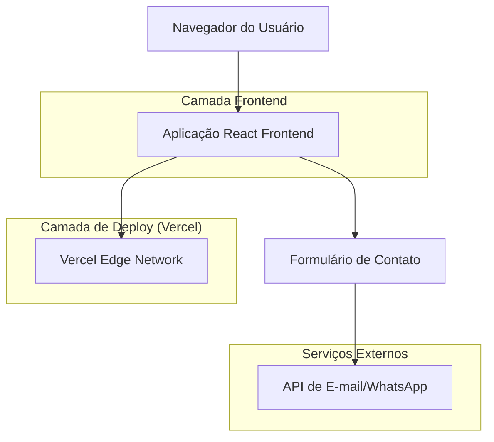
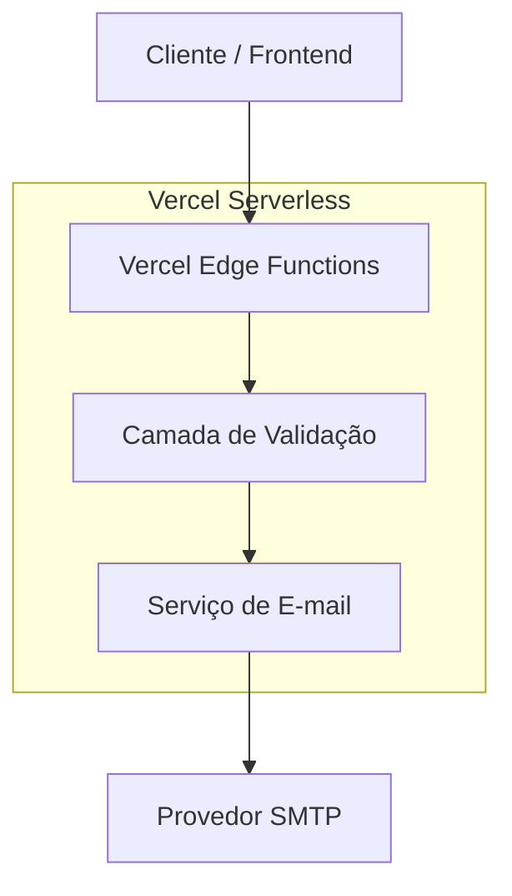
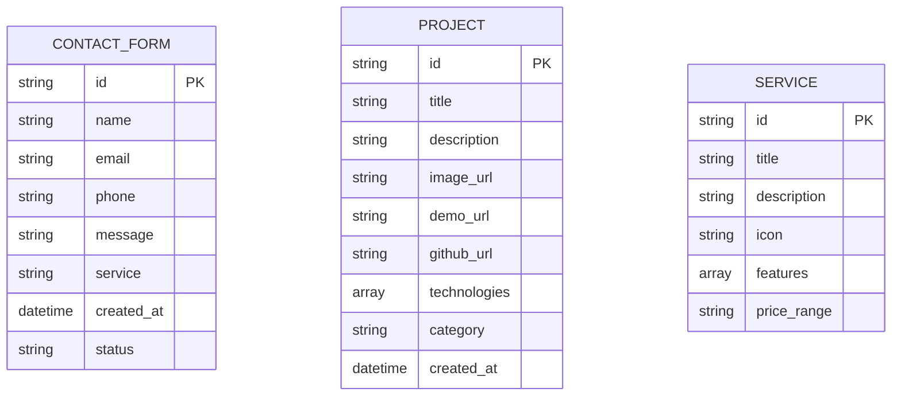

# Documento de Arquitetura Técnica - Portfólio Empresa de Desenvolvimento Web

## 1. Design da Arquitetura



## 2. Descrição da Tecnologia

* **Frontend**: React\@18 + TypeScript + Tailwind CSS\@3 + Vite

* **Animações**: Framer Motion

* **Ícones**: Lucide React

* **Formulários**: React Hook Form + Zod

* **Deploy**: Vercel (Static Site Generation)

* **Backend**: Serverless Functions (Vercel) para formulário de contato

## 3. Definições de Rotas

| Rota        | Propósito                                                       |
| ----------- | --------------------------------------------------------------- |
| /           | Página inicial com hero section, serviços e navegação principal |
| /#services  | Seção de serviços (âncora na página inicial)                    |
| /#portfolio | Seção do portfólio de projetos (âncora na página inicial)       |
| /#about     | Seção sobre a empresa (âncora na página inicial)                |
| /#contact   | Seção de contato com formulário (âncora na página inicial)      |

## 4. Definições de API

### 4.1 API Principal

Envio de formulário de contato

```
POST /api/contact
```

Request:

| Nome do Parâmetro | Tipo   | Obrigatório | Descrição                     |
| ----------------- | ------ | ----------- | ----------------------------- |
| name              | string | true        | Nome completo do cliente      |
| email             | string | true        | E-mail válido para contato    |
| phone             | string | false       | Telefone para contato         |
| message           | string | true        | Mensagem detalhada do cliente |
| service           | string | false       | Tipo de serviço de interesse  |

Response:

| Nome do Parâmetro | Tipo    | Descrição                       |
| ----------------- | ------- | ------------------------------- |
| success           | boolean | Status do envio da mensagem     |
| message           | string  | Mensagem de confirmação ou erro |

Exemplo de Request:

```json
{
  "name": "João Silva",
  "email": "joao@empresa.com",
  "phone": "+55 11 99999-9999",
  "message": "Gostaria de um orçamento para desenvolvimento de site institucional",
  "service": "criacao-sites"
}
```

Exemplo de Response:

```json
{
  "success": true,
  "message": "Mensagem enviada com sucesso! Entraremos em contato em breve."
}
```

## 5. Arquitetura do Servidor



## 6. Modelo de Dados

### 6.1 Definição do Modelo de Dados



### 6.2 Estrutura de Dados (TypeScript Interfaces)

```typescript
// Tipos para formulário de contato
interface ContactFormData {
  name: string;
  email: string;
  phone?: string;
  message: string;
  service?: 'criacao-sites' | 'aplicacoes-web' | 'solucoes-personalizadas';
}

// Tipos para projetos do portfólio
interface Project {
  id: string;
  title: string;
  description: string;
  imageUrl: string;
  demoUrl?: string;
  githubUrl?: string;
  technologies: string[];
  category: 'website' | 'webapp' | 'custom';
  createdAt: Date;
}

// Tipos para serviços
interface Service {
  id: string;
  title: string;
  description: string;
  icon: string;
  features: string[];
  priceRange: string;
}

// Tipos para resposta da API
interface ApiResponse {
  success: boolean;
  message: string;
  data?: any;
}
```

### 6.3 Configuração de Deploy na Vercel

```json
// vercel.json
{
  "framework": "vite",
  "buildCommand": "npm run build",
  "outputDirectory": "dist",
  "functions": {
    "app/api/contact.ts": {
      "runtime": "nodejs18.x"
    }
  },
  "env": {
    "SMTP_HOST": "@smtp_host",
    "SMTP_PORT": "@smtp_port",
    "SMTP_USER": "@smtp_user",
    "SMTP_PASS": "@smtp_pass",
    "CONTACT_EMAIL": "@contact_email"
  }
}
```

### 6.4 Estrutura de Pastas do Projeto

```
portifolio/
├── public/
│   ├── images/
│   │   ├── projects/
│   │   └── team/
│   └── favicon.ico
├── src/
│   ├── components/
│   │   ├── ui/
│   │   ├── sections/
│   │   └── layout/
│   ├── data/
│   │   ├── projects.ts
│   │   └── services.ts
│   ├── hooks/
│   ├── types/
│   ├── utils/
│   └── App.tsx
├── api/
│   └── contact.ts
├── package.json
├── tailwind.config.js
├── vite.config.ts
└── vercel.json
```

